# evidence2html

Put pen-test outputs in one folder, run a short CLI, open **one HTML report**—merged scans, evidence, optional ASCII banner. **PDF** when you want slides (16:9) or a **DIN-style A4** document.

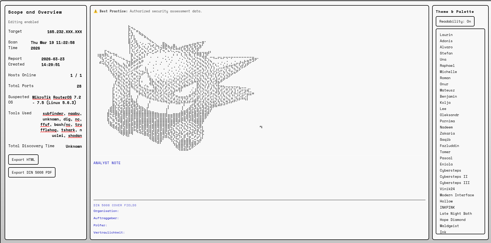

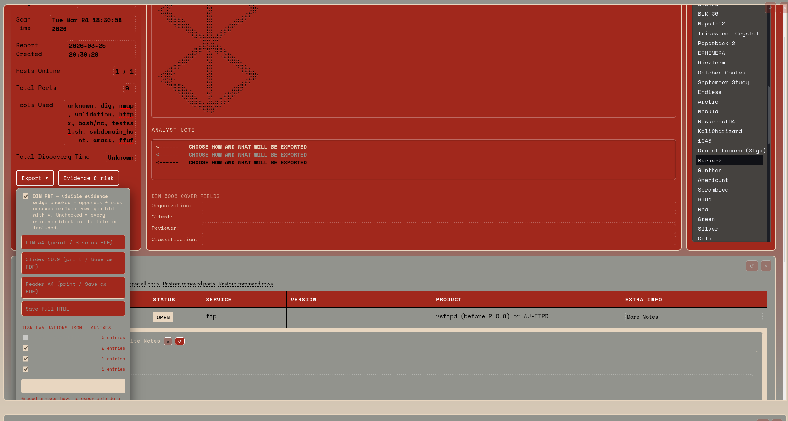

## Requirements

- Python 3.8+
- `xsltproc` (e.g. `sudo apt install xsltproc` on Debian/Kali)
- Chromium or Chrome on PATH for PDF

No pip dependencies.

## Quick start

```bash
git clone https://github.com/CosmicSlothOracle/evidence2html.git
cd evididencetohtml
python3 evidence2html.py
```

Pick your evidence folder and report name; the tool merges what it finds and opens the report.

## Features

- **Scope** — Target, timing, counts, tools; edit in the browser.
- **Themes & ASCII** — Sidebar looks; optional banners from `ascii_arts/` (bundled or next to your run).

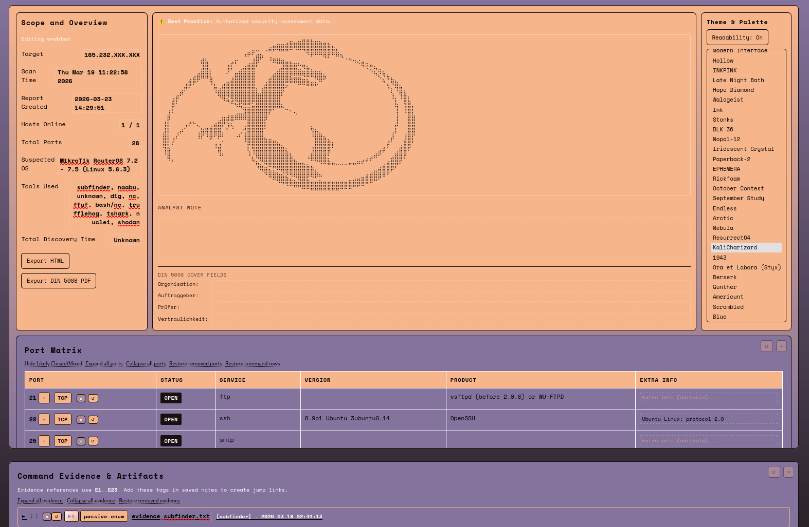

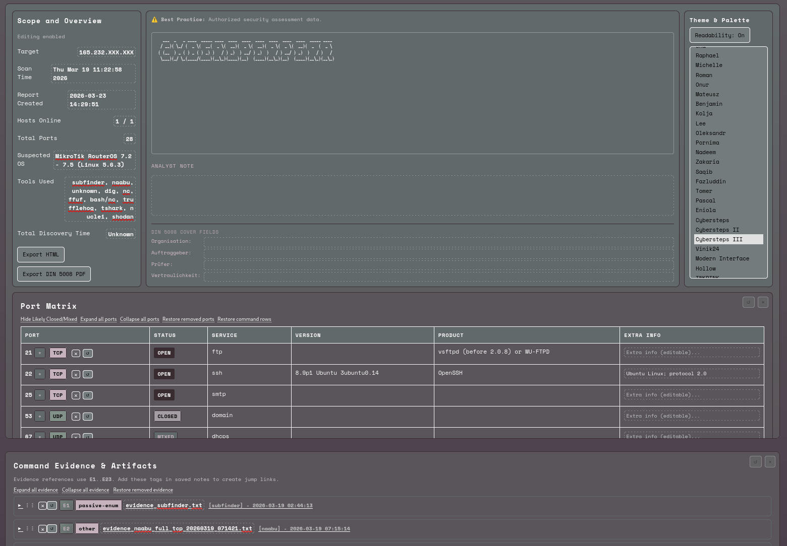

- **Port matrix** — Services, versions, extra fields, analyst notes, and command context per port.

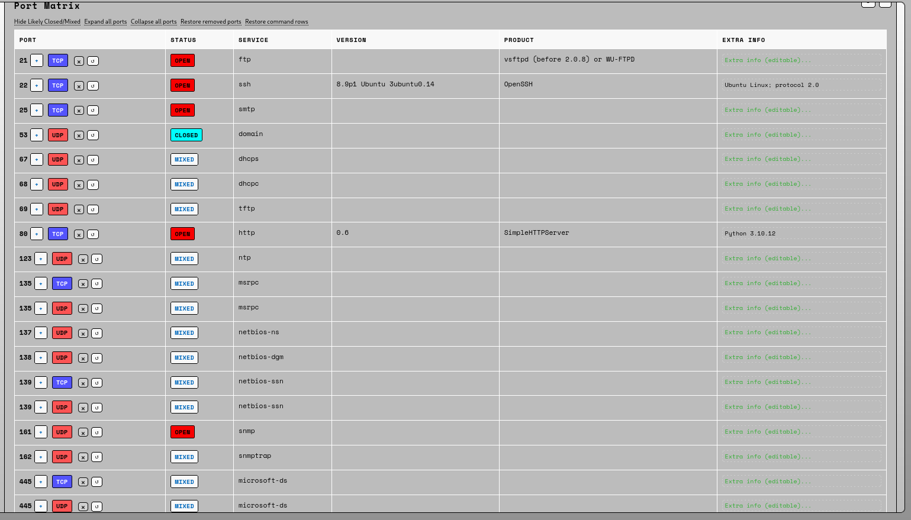

- **Editor** - Edit style however you seem fit 

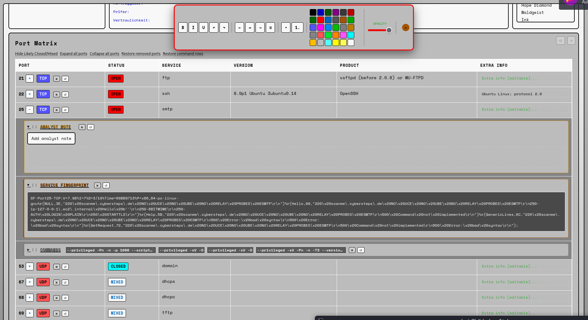

-**Notes** - Export and autoformat after DIn5008 all notes and edits
           
 -**Attention**  - ! Browsercache holds all browser input if you delete it all notes or edits will be lost !

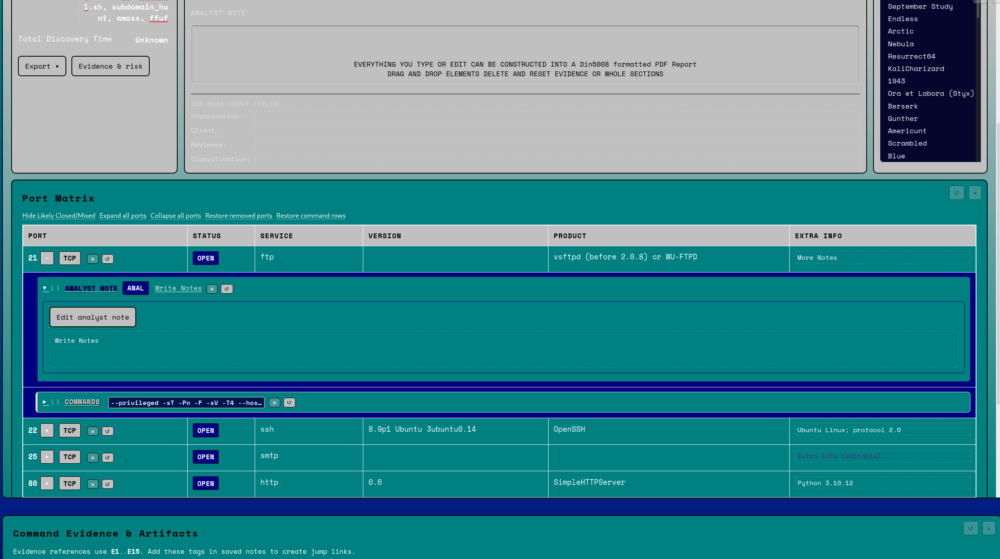

- **Evidence** — Expandable items; edit titles and text; `E1`…`En` in notes for jump links. Optional risk views for richer PDF annexes.

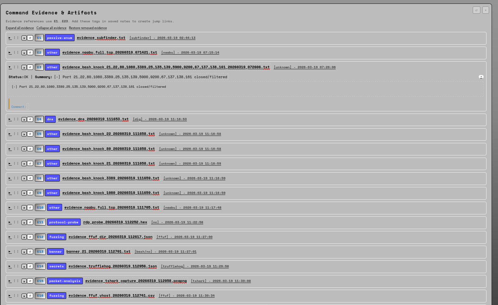

-**Risk-Evaluation** - Run automated Risk assesements accordingly to NIST ISO BSI extracted only when nuclei evidence present
                     - CVEE can be imported manually and appended to the export

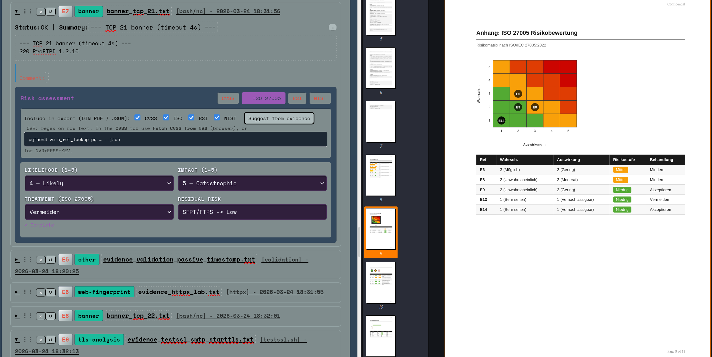

- **Export** — Save HTML or print PDF; what you changed on the page is what you get in the export.

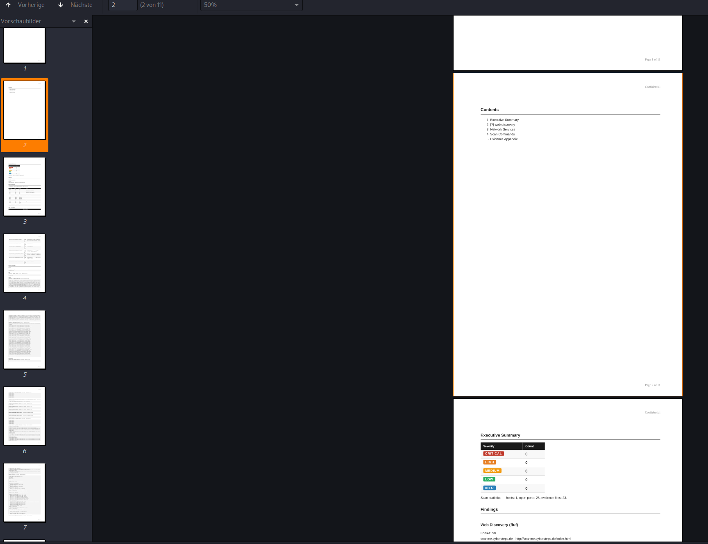

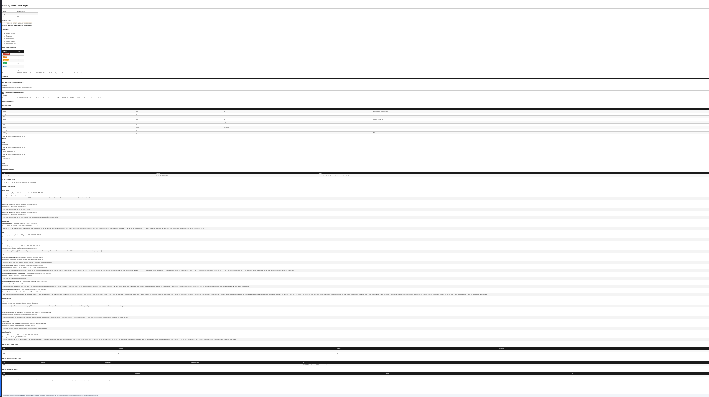

## Typical evidence folder

```
my_run/
  scan_tcp.xml
  scan_udp.xml
  nuclei.json          # optional
  evidence_ffuf_*.json
  evidence_*.txt
  ascii_arts/          # optional; or use repo ascii_arts/
    alice.txt
```

## Naming
There are name conventions that need to be met or the script will not pick up that file

Practical names for a TCP sweep: anything like scan_tcp.xml, nmap_tcp.xml, or nmap_20260325.xml works. Using -oX (XML) is what you want.

Example (TCP SYN sweep, XML out):

nmap -sS -Pn -p 1-65535 -T4 --min-rate 500 10.0.0.1 -oX /path/to/evidence/scan_tcp.xml

This function is easy to expand if needed adding more naming conventions if needed. 

def _discover_xml_files(evidence_dir: str) -> list:
"""Collect Nmap-style inputs. Includes merged_scan_*.xml (timestamped merges), not merged_scan.xml."""
    xml_files = []
    patterns =-
    > > > ("scan_*.xml", "nmap*.xml", "portscan.xml", "services.xml", "merged_scan_*.xml") < < < 
    seen = set()
    for pattern in patterns:
        found = sorted(glob.glob(os.path.join(evidence_dir, pattern)))
        for f in found:
            base = os.path.basename(f)
            if base == "merged_scan.xml":
                continue
## Conclusion

`evidence2html.py` — CLI and merge. `cosmic_clean.xsl` — report page. `pdf_export.py` — scripts cover CVE lookup and risk annex math if needed.

Easiest use is still the workflow `evidence2html.py`

Anyone reporting a issue,bug or suggestions will qualifie for eternal bliss. 

## License

MIT
